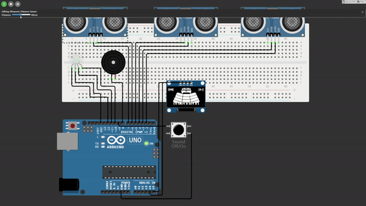

 

  

  <h3 align="center">SmartPark</h3>

  

     
    <a href="https://github.com/Bogdan016/Arduino-Intelligent-Parking-System"><strong>Explore the docs »</strong></a>
     
     
    <a href="https://github.com/Bogdan016/Arduino-Intelligent-Parking-System/blob/main/images/ProjectDemo.gif">View Demo</a>
    ·
    <a href="https://github.com/Bogdan016/Arduino-Intelligent-Parking-System/issues/new?assignees=&labels=&projects=&template=bug_report.md&title=">Report Bug</a>
    ·
    <a href="https://github.com/othneildrew/Best-README-Template/issues/new?labels=bug&template=bug-report---.md">Request Feature</a>
  

  
Table of Contents

  <ol>
    <li>
      <a href="#about-the-project">About The Project</a>
    </li>
    <li><a href="#acknowledgments">Acknowledgments</a></li>
  </ol>

## About The Project

  
  

  This project is dedicated to the development of a reverse parking assistance system, designed to simplify the parking process by using Arduino technology combined with ultrasonic sensors. 
It accurately measures and displays the distance to obstacles located behind the vehicle, enhancing safety and efficiency for drivers.

Technical Details:

* Microcontroller: Arduino Uno is used as the control unit for processing sensor data and managing the display output.
* Sensors: Three ultrasonic sensors provide spatial data by detecting objects in the vehicle’s path. The distances measured by these sensors are used to determine proximity to obstacles.
* Display: An OLED display presents real-time information in a user-friendly format, including a graphical representation of a car, distance measurements in units, and sound status indicators.
* Auditory Feedback: A buzzer system is integrated to offer auditory alerts. These alerts vary in frequency based on the proximity to obstacles, with the ability to toggle the sound on or off via a user-controlled button.

## Acknowledgments

This project would not have been possible without the contributions and resources from the following sources:

- **Wokwi Simulator**: For providing the simulation environment used to develop and test the parking system. [View project on Wokwi](https://wokwi.com/projects/384735044985188353).
- **Arduino**: For the essential Arduino libraries and hardware support. [Visit Arduino](https://www.arduino.cc/).
- **YouTube Tutorial**: For the tutorial that guided the initial stages of setting up ultrasonic sensors with Arduino. [Watch the video](https://www.youtube.com/watch?v=gg08H-6Z1Lo).

