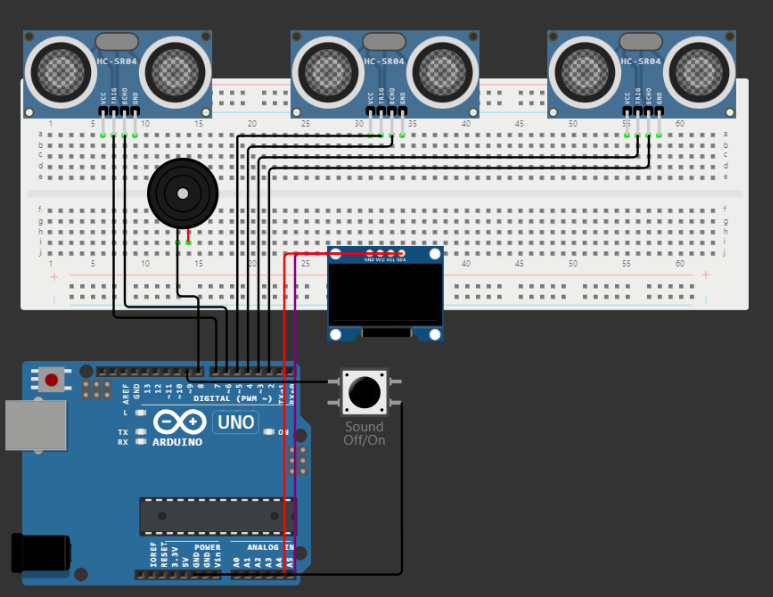
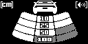
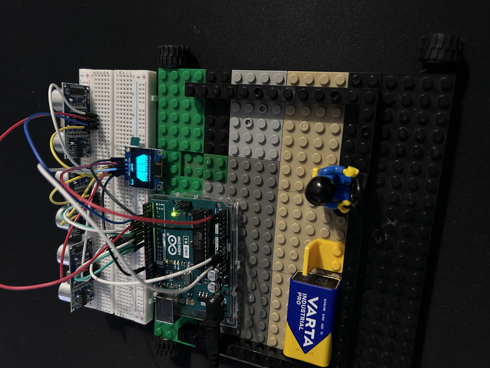

# Intelligent parking system

## Wokwi link:
[Intelligent parking system on Wokwi](https://wokwi.com/projects/384735044985188353)

## Table of Contents
1. Introduction
2. Description
3. Components
4. Circuit Diagram
5. Conclusion and personal observations
6. Acknowledgments

## Introduction
This project involves the development of a reverse parking assistance system using Arduino and ultrasonic sensors. 
The system aims to measure and display the distance to obstacles behind the vehicle, assisting drivers during the parking process.

## Description
In my project, I use an OLED display and three ultrasonic sensors to measure distances. 
The display shows a car image, unit indicator, sound indicators, and sensor readings. 
I’ve also included a buzzer that provides auditory feedback based on the measured distances. 
I can toggle the sound on and off using a button. The code for my project is well-structured and organized, making it easy for me to manage and update.

## Components
- Arduino Uno
- Ultrasonic Sensors
- OLED Display
- Buzzer
- Button

## Circuit Diagram

## Display Image

## Conclusion and personal observations

This project was the first arduino project i worked on. 
I had fun and ocassional frustration, I learned a lot about hardware, arduino and sensors. 
I also presented the project for one of my uni class so i had an ideea to add a lego "car" to make it more visually appealing.

Also i really wanted to share this design i created: 

## Acknowledgments

This project was inspired by and benefited from the following resources:

- Wokwi - [https://wokwi.com/]
- Arduino - [https://www.arduino.cc/]
- YouTube Video - [https://www.youtube.com/watch?v=gg08H-6Z1Lo]

